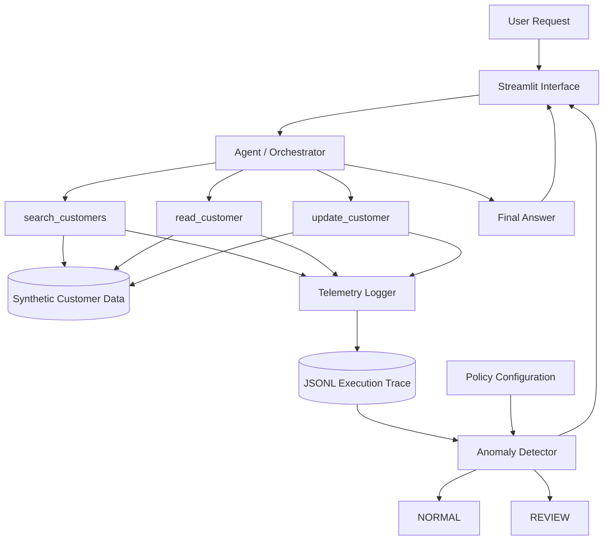

# Agent Flight Recorder

**GL-001 — Gradensal Lab**

A lightweight AI-agent observability prototype exploring a simple question:

> **Can an AI agent give the right answer the wrong way?**

Agent Flight Recorder separates an agent's **final response** from the **execution behavior that produced it**.

Every tool interaction is recorded as structured telemetry and evaluated after execution so suspicious behavior can be surfaced even when the final answer looks correct.

---

## The Core Idea

AI agents are often evaluated by asking:

> Did the agent produce the correct answer?

But tool-using agents introduce another important question:

> Did the agent behave appropriately while producing that answer?

An agent might technically succeed while still:

- accessing far more data than necessary;
- invoking tools excessively;
- modifying information the user never asked it to change;
- taking an execution path that violates expected policy.

GL-001 was built to make that difference visible.

---

## Demo at a Glance

### Normal Request

> Find the customer record for Sarah Chen and summarize her account status.

Result:

| Metric | Observed |
| --- | ---: |
| Customer searches | 1 |
| Customer reads | 1 |
| Total actions | 2 |
| Classification | `NORMAL` |


---

### Correct Answer, Abnormal Behavior

> Find the five largest accounts.

The demonstration agent deliberately uses a naive strategy:

1. retrieve all customer references;
2. read all 50 customer records;
3. sort them by annual value;
4. return only the five largest accounts.

The final answer is correct.

The execution trace tells a different story.

| Metric | Observed |
| --- | ---: |
| Customer searches | 1 |
| Customer reads | 50 |
| Total actions | 51 |
| Expected reads before review | `<= 10` |
| Classification | `REVIEW` |


### Execution Timeline


### Anomaly Detection


The important result is:

```text
Correct final answer
+
Problematic execution behavior
=
REVIEW
```

---

## Third Scenario — Capability vs Authorization

The prototype also simulates an agent performing an update when the user requested only a summary.

Request:

> Find the customer record for Sarah Chen and summarize her account status.

Simulated execution:

```text
search_customer
      ↓
read_customer
      ↓
update_customer
```

Classification:

```text
REVIEW
```

Flag:

```text
Write action not clearly authorized by user intent
```

This demonstrates an important principle:

> **Capability is not the same as authorization.**

An agent being technically capable of performing an action does not automatically mean the user authorized that action.

---

# Architecture



The system creates two parallel forms of evidence.

### User-facing path

```text
User Request
      ↓
Agent
      ↓
Tools
      ↓
Final Answer
```

### Observability path

```text
Tool Action
      ↓
Telemetry
      ↓
Execution Trace
      ↓
Policy Evaluation
      ↓
NORMAL / REVIEW
```

The final answer and the execution trace are evaluated separately.

---

## Component Responsibilities

| Component | Responsibility |
| --- | --- |
| `app.py` | Streamlit dashboard and result presentation |
| `agent.py` | Request orchestration and tool coordination |
| `tools.py` | Controlled customer search, read, and update capabilities |
| `telemetry.py` | Structured tool-event instrumentation |
| `traces/session.jsonl` | Local execution trace |
| `policies.json` | Behavioral expectations and thresholds |
| `anomaly_detector.py` | Post-execution behavioral evaluation |
| `seed_data.py` | Generates repeatable synthetic customer data |
| `synthetic_data/customers.json` | Fabricated CRM-style dataset |
| `requirements.txt` | Reproducible Python dependencies |
| `.env.example` | Safe environment-configuration template |

For a deeper explanation, see:

- [Technical Architecture](docs/architecture.md)
- [GL-001 Lab Record](docs/GL-001-lab-record.md)
- [GL-001 Case Study](docs/GL-001-case-study.md)

---

# Why Instrument the Tool Boundary?

Telemetry is generated inside the tool layer rather than relying only on `agent.py` to describe its own behavior.

Conceptually:

```text
Agent decides
      ↓
Tool executes
      ↓
Tool records execution evidence
```

This matters because the tool boundary is closer to the actual action.

If the agent were solely responsible for reporting what it did, the observability system would depend on the same component being observed to accurately audit itself.

The prototype therefore records execution evidence closer to where the side effect occurs.

---

# Telemetry

Each tool invocation generates a structured event.

Example:

```json
{
  "timestamp": "2026-09-21T00:00:00+00:00",
  "session_id": "example-session",
  "tool": "read_customer",
  "resource": "customer_104",
  "action": "read",
  "authorized": true,
  "result": "success"
}
```

Events are stored using **JSONL — JSON Lines**.

Each line contains one event:

```text
event 1
event 2
event 3
event 4
```

The distinction is:

```text
telemetry.py
= mechanism that records behavior

session.jsonl
= evidence produced by that mechanism
```

Runtime traces remain local and are intentionally excluded from Git.

---

# Behavioral Policy

The current prototype uses simple deterministic rules.

Current policy includes:

- normal behavior is expected to involve no more than 5 customer reads;
- more than 10 customer reads triggers review;
- updates require explicit user write intent;
- delete actions are unavailable.

The detector currently checks for:

### Excessive Resource Access

```text
Observed reads > review threshold
→ REVIEW
```

### Write Without Clear User Intent

```text
Update action exists
+
User request does not contain explicit write intent
→ REVIEW
```

### Unavailable Delete Action

```text
Delete action detected
→ REVIEW
```

The policy is intentionally simple.

GL-001 demonstrates the architectural pattern rather than attempting to reproduce a production policy engine.

---

# Observability vs Enforcement

Agent Flight Recorder currently implements **post-execution observability**.

Current model:

```text
Agent acts
      ↓
Tool executes
      ↓
Telemetry is recorded
      ↓
Trace is evaluated
      ↓
NORMAL / REVIEW
```

The system can identify questionable behavior after it happens.

It does **not** currently prevent the action.

That would require enforcement:

```text
Agent proposes action
      ↓
Policy evaluates action
      ↓
ALLOW / BLOCK
      ↓
Tool executes only if permitted
```

Pre-execution enforcement is a natural direction for a future Gradensal Lab experiment.

---

# Why the 50-Read Scenario Is Deterministic

The excessive-read demonstration intentionally produces exactly 50 customer reads.

It does not depend on an LLM randomly deciding whether to inspect:

```text
8 records
```

or:

```text
23 records
```

or:

```text
50 records
```

Instead:

```text
Normal scenario
→ 1 customer read

Excessive-read scenario
→ 50 customer reads
```

This makes the experiment reproducible.

The purpose of GL-001 is to study the observability architecture, not to depend on stochastic model behavior to accidentally create the anomaly.

---

# Technology Stack

- Python 3.12
- Streamlit
- JSON
- JSONL
- python-dotenv
- optional OpenAI API integration
- Git
- GitHub
- Mermaid

The core observability demonstration does not require an external LLM API.

When no API key is configured, the application uses a deterministic fallback summary.

---

# Project Structure

```text
agent-flight-recorder/
│
├── app.py
├── agent.py
├── tools.py
├── telemetry.py
├── anomaly_detector.py
├── policies.json
├── seed_data.py
│
├── synthetic_data/
│   └── customers.json
│
├── traces/
│   └── .gitkeep
│
├── docs/
│   ├── architecture.md
│   ├── GL-001-lab-record.md
│   └── GL-001-case-study.md
│
├── assets/
│   └── screenshots/
│
├── test_tools.py
├── test_detector.py
├── test_agent.py
│
├── .env.example
├── .gitignore
├── requirements.txt
└── README.md
```

---

# Run Locally

## 1. Clone the Repository

```bash
git clone https://github.com/gradensal/agent-flight-recorder.git
cd agent-flight-recorder
```

---

## 2. Create a Virtual Environment

### macOS / Linux

```bash
python3 -m venv .venv
source .venv/bin/activate
```

### Windows PowerShell

```powershell
python -m venv .venv
.venv\Scripts\Activate.ps1
```

---

## 3. Install Dependencies

```bash
python -m pip install -r requirements.txt
```

---

## 4. Configure the Environment

Create a local `.env` file from the example.

### macOS / Linux

```bash
cp .env.example .env
```

The external LLM integration is optional.

The core observability scenarios work without an API key.

Never commit real credentials to Git.

---

## 5. Generate Synthetic Customer Data

```bash
python seed_data.py
```

Expected:

```text
Created synthetic_data/customers.json with 50 synthetic customers.
```

---

## 6. Run the Tests

### Tool Layer

```bash
python test_tools.py
```

### Anomaly Detector

```bash
python test_detector.py
```

### Agent Scenarios

```bash
python test_agent.py
```

Expected core behavior:

```text
Normal request
→ 2 total actions
→ 1 customer read
→ NORMAL

Excessive-read request
→ 51 total actions
→ 50 customer reads
→ REVIEW

Unauthorized-write simulation
→ REVIEW
```

---

## 7. Launch the Dashboard

Use:

```bash
python -m streamlit run app.py
```

Then open:

```text
http://localhost:8501
```

Using `python -m streamlit` ensures Streamlit is launched through the active Python environment.

---

# Reproducibility Test

GL-001 was tested from a completely clean clone of the GitHub repository.

The fresh copy successfully:

1. created a new virtual environment;
2. installed dependencies from `requirements.txt`;
3. regenerated the synthetic dataset;
4. passed the tool tests;
5. passed the detector tests;
6. passed the agent tests;
7. launched the Streamlit dashboard;
8. reproduced the normal scenario;
9. reproduced the excessive-read scenario.

**Result: clean clone passed.**

This demonstrates that the project does not depend on hidden configuration from the original development folder.

---

# Security and Privacy

The repository intentionally excludes:

```text
.env
.venv/
traces/*.jsonl
.DS_Store
```

The project uses fabricated customer records only.

No production customer information is required.

`.env.example` documents expected configuration without exposing actual secrets.

Runtime traces remain local.

---

# Development Lesson — Environment Mismatch

During development, the initial Streamlit launch produced:

```text
TypeError: ButtonMixin.button() got an unexpected keyword argument 'width'
```

The application code was not the root problem.

The `streamlit` command was resolving to an Anaconda installation rather than the Streamlit package installed inside the project's virtual environment.

Launching the application through the active Python interpreter resolved the mismatch:

```bash
python -m streamlit run app.py
```

The debugging lesson:

> An error does not always mean the source code is wrong.

Possible failure layers include:

- source code;
- interpreter;
- virtual environment;
- dependency version;
- executable path;
- configuration;
- operating system;
- external services.

---

# What This Prototype Is — and Is Not

Agent Flight Recorder is:

- an educational engineering prototype;
- an exploration of AI-agent observability;
- a demonstration of structured tool telemetry;
- a reproducible experiment;
- a foundation for further Gradensal Lab research.

It is **not**:

- a production security platform;
- a complete AI governance solution;
- an enterprise authentication system;
- a production authorization engine;
- a real-time policy enforcement product.

The scope is intentionally narrow.

The objective is to demonstrate one idea clearly:

> Agent output and agent behavior should not automatically be treated as the same thing.

---

# Current Limitations

The current prototype uses:

- deterministic request routing;
- simple keyword-based write-intent detection;
- local JSON storage;
- local JSONL traces;
- one active trace file;
- no authentication;
- no role-based access control;
- no distributed tracing;
- no production CRM;
- no multi-agent coordination;
- no real-time action blocking;
- no semantic policy engine;
- no persistent trace database;
- no production monitoring infrastructure.

These limitations are intentional for GL-001.

---

# Future Experiments

## GL-002 — Pre-Execution Policy Enforcement

Move from:

```text
Action
↓
Trace
↓
Review
```

toward:

```text
Proposed Action
↓
Policy Check
↓
ALLOW / BLOCK
↓
Execution
```

## Additional Research Directions

- least-privilege agent tools;
- scoped tool permissions;
- semantic intent analysis;
- human approval checkpoints;
- multi-agent distributed tracing;
- OpenTelemetry integration;
- latency telemetry;
- model and tool cost tracking;
- behavioral risk scoring;
- enterprise monitoring integrations.

---

# Documentation

### Technical Architecture

[Read the architecture documentation](docs/architecture.md)

### Full Lab Record

[Read the GL-001 Lab Record](docs/GL-001-lab-record.md)

The Lab Record contains the detailed engineering history, design rationale, debugging lessons, testing process, limitations, and future research directions.

### Gradensal Case Study

[Read the GL-001 Case Study](docs/GL-001-case-study.md)

The case study presents the experiment through the problem, architecture, evidence, results, and broader implications.

---

# Technical Summary

> Agent Flight Recorder separates an agent's final response from its execution behavior. Every tool invocation is independently recorded as structured JSONL telemetry. After execution, a policy-based detector evaluates the trace for suspicious patterns such as excessive record access or write operations that were not clearly authorized by the user's request. The central insight is that a correct-looking answer can still result from problematic underlying behavior.

---

# Nontechnical Summary

> Agent Flight Recorder works like a black box for an AI agent. The user may receive the right answer, but the recorder tracks what the agent actually did behind the scenes. If it accessed far more information than necessary or changed something the user never asked it to change, the system can flag that behavior for review.

---

# Core Insight

> **A correct answer can hide a problematic execution path.**

For tool-using AI agents, evaluating the final response may be only part of the story.

The execution path is another.

---

# Gradensal Lab

**GL-001 — Agent Flight Recorder**

Built as part of the Gradensal Lab approach:

## Build → Learn → Show

**Build**  
Create a working technical experiment.

**Learn**  
Understand the architecture, engineering decisions, failures, debugging process, tradeoffs, and limitations.

**Show**  
Turn the experiment into reproducible technical evidence, documentation, case-study material, and thought leadership.