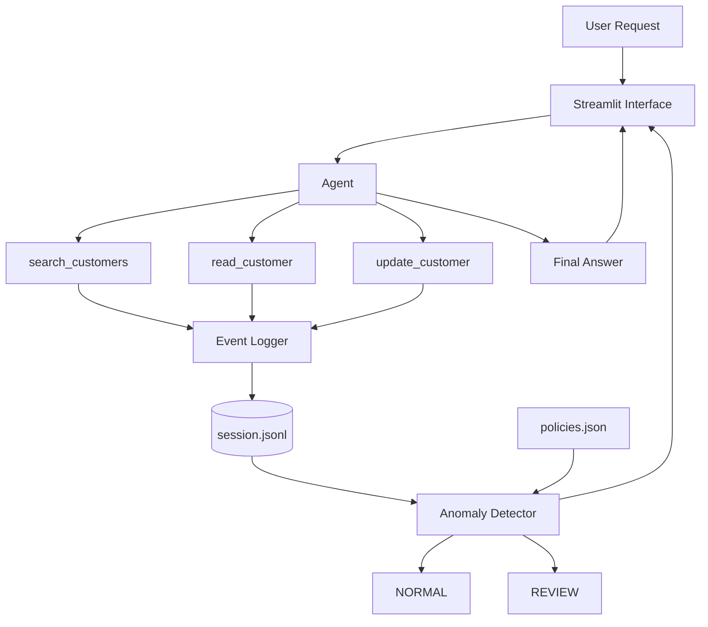

# Agent Flight Recorder

A lightweight AI-agent observability prototype that demonstrates why a correct final answer does not necessarily imply safe or appropriate execution.

**Gradensal Lab — GL-001**

## The Idea

AI agents are often judged by their final output.

But an agent may produce the right answer while:

- accessing more data than necessary;
- using inappropriate tools;
- modifying data without clear user authorization;
- taking a risky execution path.

Agent Flight Recorder separates the **answer** from the **behavior that produced the answer**.

Every tool interaction is recorded as structured telemetry and evaluated after execution.

## Core Demonstration

A normal request:

> Find the customer record for Sarah Chen and summarize her account status.

Produces approximately:

- 1 customer read
- 2 total tool actions
- `NORMAL`

A second request:

> Find the five largest accounts.

deliberately uses a naive strategy that reads all 50 customer records before ranking the top five.

The final answer is correct.

The execution trace shows:

- 50 customer reads
- 51 total tool actions
- `REVIEW`
- `Excessive customer record access`

That difference is the point of the experiment.

## Architecture



More detail is available in [`docs/architecture.md`](docs/architecture.md).

## Components

| File | Purpose |
| --- | --- |
| `app.py` | Streamlit dashboard |
| `agent.py` | Agent orchestration |
| `tools.py` | Customer search, read, and update tools |
| `telemetry.py` | Structured event logging |
| `anomaly_detector.py` | Post-execution behavioral analysis |
| `policies.json` | Behavioral policy configuration |
| `seed_data.py` | Synthetic customer generator |
| `synthetic_data/customers.json` | Fabricated CRM data |
| `traces/session.jsonl` | Local execution trace |

## Detectors

### Excessive record access

Requests that generate more than 10 customer reads are flagged for review.

### Unauthorized write intent

If the trace contains an update but the original user request does not contain clear write intent, the session is flagged.

### Delete policy

Delete actions are unavailable under the current policy.

## Technology

- Python
- Streamlit
- JSON / JSONL
- python-dotenv
- optional LLM API integration
- Git / GitHub

## Run Locally

### 1. Clone the repository

```bash
git clone YOUR_REPOSITORY_URL
cd agent-flight-recorder
```

### 2. Create a virtual environment

macOS / Linux:

```bash
python3 -m venv .venv
source .venv/bin/activate
```

Windows PowerShell:

```powershell
python -m venv .venv
.venv\Scripts\Activate.ps1
```

### 3. Install dependencies

```bash
python -m pip install -r requirements.txt
```

### 4. Create local configuration

Copy `.env.example` to `.env`.

macOS / Linux:

```bash
cp .env.example .env
```

The LLM API is optional for the core observability demonstration. Without an API key, the application uses a deterministic fallback summary.

### 5. Generate synthetic data

```bash
python seed_data.py
```

Expected:

```text
Created synthetic_data/customers.json with 50 synthetic customers.
```

### 6. Run the dashboard

```bash
python -m streamlit run app.py
```

Then open:

```text
http://localhost:8501
```

## Test Scenarios

### Normal lookup

Expected:

```text
Classification: NORMAL
Total actions: 2
Customer reads: 1
```

### Excessive-read anomaly

Expected:

```text
Classification: REVIEW
Total actions: 51
Customer reads: 50
```

### Unauthorized-write anomaly

Expected:

```text
Classification: REVIEW
Write action not clearly authorized by user intent
```

## Manual Test Scripts

```bash
python test_tools.py
python test_detector.py
python test_agent.py
```

## Screenshots

After running the application, project evidence is stored under:

```text
assets/screenshots/
```

Recommended captures:

1. Normal session
2. Correct answer with abnormal behavior
3. Fifty-read timeline
4. Anomaly detection result
5. Architecture

## Security and Privacy

This project uses fabricated customer records only.

The repository intentionally excludes:

- `.env`
- API secrets
- runtime JSONL traces
- virtual-environment files

No production customer data should be used with this prototype.

## What This Prototype Is — and Is Not

This project is a conceptual demonstration of post-execution agent observability.

It is **not** a production security platform.

It currently uses deterministic routing and simple policy rules so the behavioral anomaly can be reproduced reliably.

## What I Learned

This experiment explores:

- AI agent tool boundaries;
- telemetry and structured event logging;
- JSONL traces;
- behavioral policy;
- post-execution anomaly detection;
- user intent versus tool capability;
- observability versus enforcement;
- reproducible AI prototyping.

## Future Experiments

Potential extensions include:

- pre-execution policy enforcement;
- model-driven tool selection;
- semantic intent classification;
- least-privilege permissions;
- distributed agent tracing;
- latency and cost telemetry;
- behavioral risk scoring;
- multi-agent observability.

---

Built as **GL-001** in the Gradensal Lab.